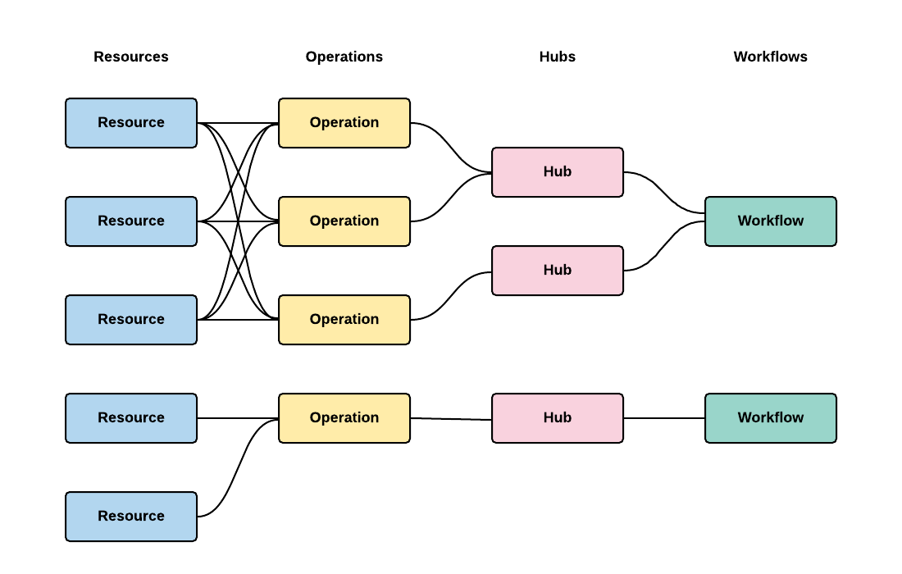
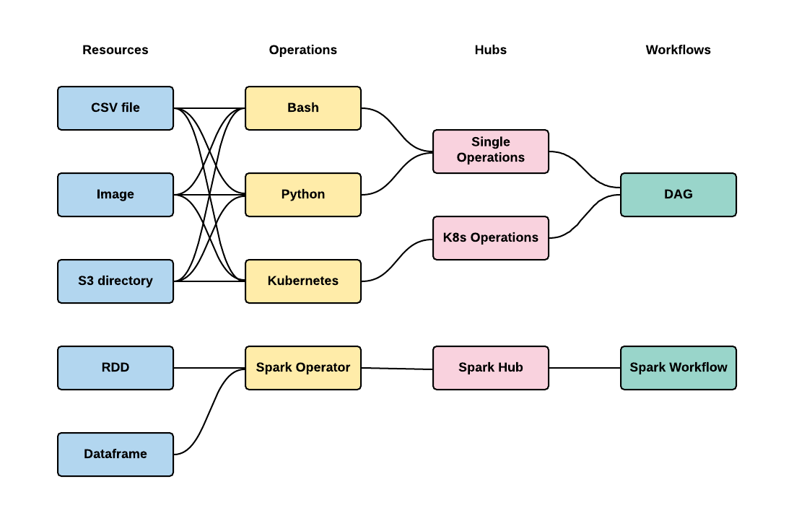

.. _plynx-configuration:

===========================
Configuration
===========================

Configuration file is a way to customize and extend PLynx for your needs.
It defines structure of the platform, declares plugins and their interaction.

An example of a config file can be found here: `config.yaml <https://github.com/plynx-team/plynx/blob/master/config.yaml>`_

.. _plynx-configuration-mongodb:

Executors
===========================

PLynx is using MongoDB to store Workflows, Operations, Runs and other metadata.
API and Workers need to have access to the database to work properly.

.. code-block:: yaml

    mongodb:
      user: <username>
      password: <password>
      host: <server ip>
      port: <server port>

.. _plynx-configuration-storage:

Storage
===========================

All of the artifacts will be stored as files.
Your Resource plugins :ref:`plynx-plugins-resources` define the way how to handle them.

.. code-block:: yaml

    storage:
      scheme: <scheme_label>
      prefix: <prefix>

Here are possible schemas that works as a driver to a file storage.

+----------+----------------------------+----------------------------------------------------------------------------------------------------------------------------------------------------------------------------------------------------------------------+
| Schema   | Prefix example             | Description                                                                                                                                                                                                          |
+==========+============================+======================================================================================================================================================================================================================+
| ``file`` | ``/data/resources/``       | Using a local directory as a file storage. Note the the file system should be accessible by API and all of the workers. This can be done by running everything on a single machine or mounting a persistent storage. |
+----------+----------------------------+----------------------------------------------------------------------------------------------------------------------------------------------------------------------------------------------------------------------+
| ``gs``   | ``gs:///plynx-resources/`` | Google Cloud Storage driver.                                                                                                                                                                                         |
+----------+----------------------------+----------------------------------------------------------------------------------------------------------------------------------------------------------------------------------------------------------------------+
| ``s3``   | ``s3:///plynx-resources/`` | AWS s3 driver.                                                                                                                                                                                                       |
+----------+----------------------------+----------------------------------------------------------------------------------------------------------------------------------------------------------------------------------------------------------------------+

.. _plynx-configuration-auth:

Auth
===========================

PLynx can run in multiuser mode if you provide it with a secret key.
It is used to generate authentication tokens.

Note you may also use ``--secret-key`` argument running API server in order to avoid keeping the key in a file for security concerns.

.. code-block:: yaml

    auth:
      secret_key: <secret key>

.. _plynx-configuration-web:

Web
===========================

This part of a configuration file is used by the API server.
It customizes flask web service.

.. code-block:: yaml

    web:
      host: <host>
      port: <port>
      endpoint: <endpoint>
      debug: <debug mode>

.. _plynx-configuration-plugins:

Plugins
===========================

The architecture of PLynx supports various use cases.
It does not rely on a single backend or workflow.
PLynx is basically a graph editor with plugins that provide with backend computation.

Simple structure of plugins is show below.

Please look at an example below.
This architecture supports two kinds of Workflows with their own backend and Operations.
It can be all configured in ``config.yaml`` without any change to PLynx.
Using ``config.yaml`` allows to set up PLynx for your use case without making changes to the platform to avoid forking and using outdated version of PLynx.

.. _plynx-configuration-plugins-workflows:

Workflows
---------------------------

There can be can be multiple types of Workflows that share some Hubs or no Hubs at all.
Workflow backend is provided by :ref:`plynx-plugins-executors`.

Examples:
- DAG executor that runs operations one by one or in parallel based on the order given by graph structure.
- Spark executor that materializes graph into spark code.
- Image processing pipeline that applies filters and transformations in given order.

.. code-block:: yaml

    workflows:
      - kind: <unique identifier>
        title: <readable title>
        executor: <executor class>
        hubs:
          - <list of hub identifiers>

.. _plynx-configuration-plugins-hubs:

Hubs
---------------------------

Main reason of using Hubs is to organize Operations in a useful and convenient way.
Hubs are using backend from :ref:`plynx-plugins-hubs`.

Examples:
- Database hub searches all of the Operations from the database.
- Static hub serves a static list of Operations.
- PLynx supports hierarchical structure of a catalog of Operations using Groups.
- Using external sources that open new Operations libraries or serve additional features such as version control.

.. code-block:: yaml

    hubs:
      - kind: <unique identifier>
        title: <readable title>
        icon: <icon>
        cls: <hub class>
        args:
          <additional arguments>

.. _plynx-configuration-plugins-operations:

Operations
---------------------------

Operations form building blocks for Workflows.
They can be either atomic, i.e. represent a single script, or they can consist of other Operations.
Operation backend is provided by :ref:`plynx-plugins-executors`.

Examples:
- Python script.
- Bash script.
- Same as Python or Bash, but using its own environment, such as additional API or SDK or custom hardware.

.. code-block:: yaml

    operations:
      - kind: <unique identifier>
        title: <readable title>
        executor: <executor class>
        icon: <icon>
        color: <color>
        resources:
          <list of resource identifiers>

Resources
---------------------------

Resources are an abstraction for working with artifacts.
Each artifact in PLynd is a file.
Resources define some standardized interface to work them.
Resources backend is provided by :ref:`plynx-plugins-resources`.

Examples:
- Simple file.
- Directory. It will be stored as an archive in :ref:`plynx-configuration-storage`. Directory resource will take care of unzipping it before starting an Operation and will take of it when it successfully finishes.
- Executable. This is a file with unix flag ``+x`` set.

.. code-block:: yaml

    resources:
      - kind: <unique identifier>
        title: <readable title>
        cls: <resource class>
        icon: <icon>
        color: <color>
