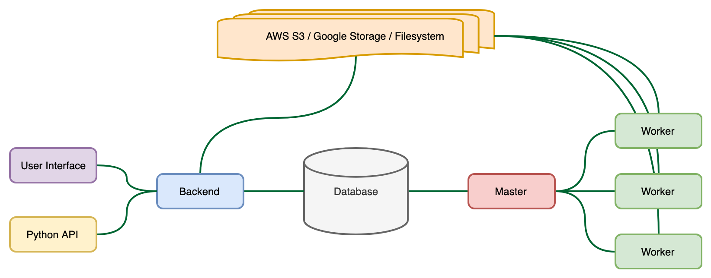
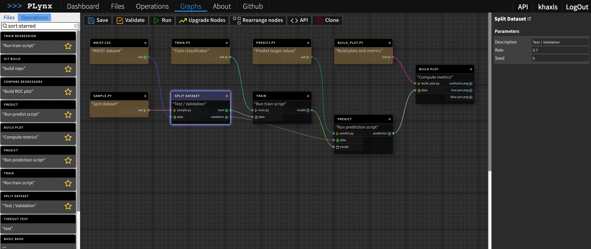
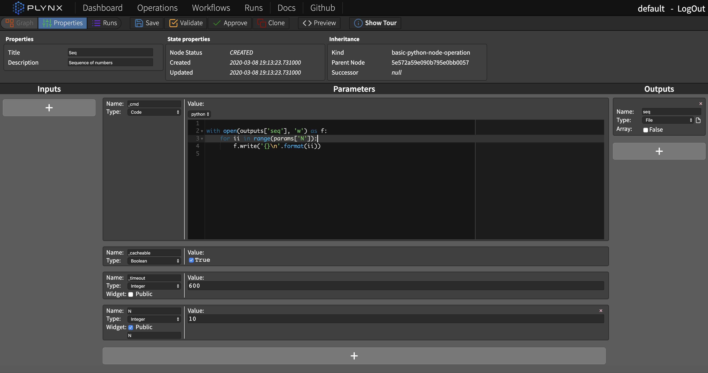
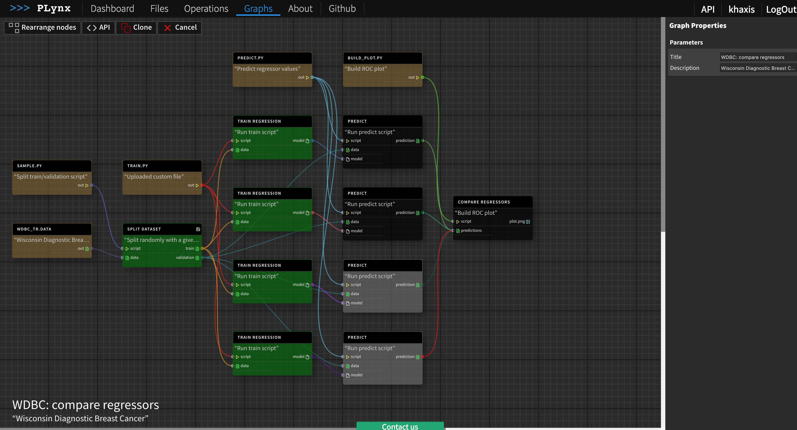
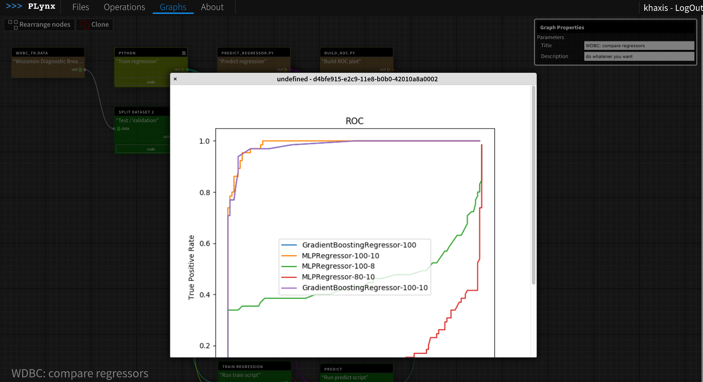

Features
===========

Distributed computation
-----------------------

All of the computation is distributed across multiple workers. You can conduct multiple experiments simultaneously. Intermediate results will be stored in the cloud and reused. No need to start your experiment from scratch.

Graph Editor
-----------------------

Interactive User Interface. You can clone successful experiment and reuse it or create one from scratch. PLynx manages history of the experiments and they can be reproduced.

Operations editor
-----------------------

Operations can be customized independently from the platform. Users can define their own Operations or reuse existing ones.

Monitor progress
-----------------------

Track the progress of the experiment. Each of intermediate operations produce results that you can inspect.

Preview the results
-----------------------

View the results right in the browser.

