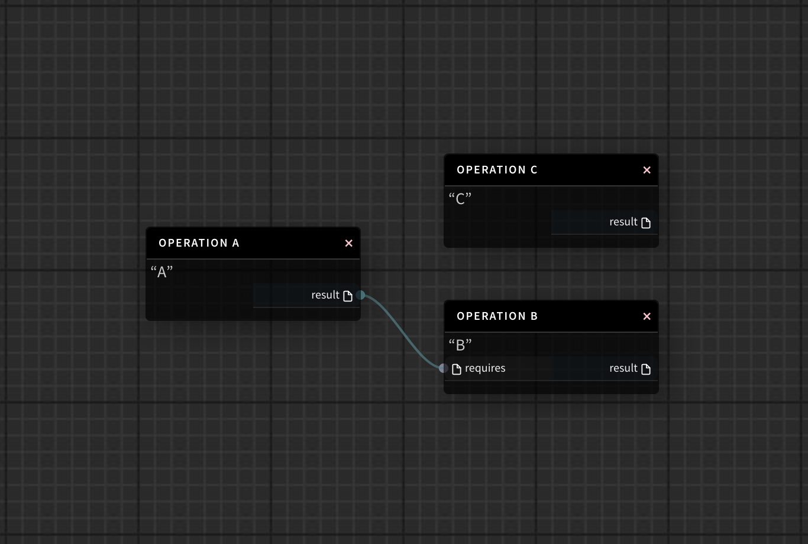
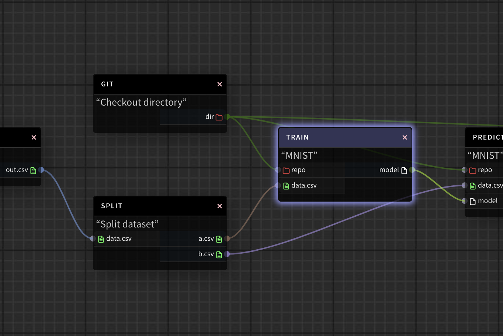
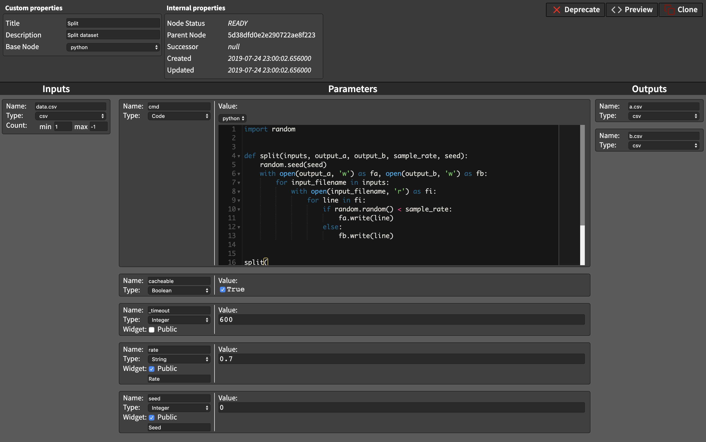

.. _plynx-plugins:

===========================
Plugins
===========================

PLynx offers a generic interface for working with custom infrastructure and services.
Different organizations have different stacks and different needs.
Using PLynx plugins can be a way for companies to customize their PLynx installation to reflect their ecosystem.

Plugins can be used as an easy way to write, share and activate new sets of features.

.. _plynx-plugins-executors:

Executors
===========================

Executors are the mechanism by which job instances get run.

Airflow has support for various executors. Current used is determined by the executor option in the core section of the configuration file.

.. _plynx-plugins-resources:

Resources
===========================

.. _plynx-plugins-hubs:

Hubs
===========================

.. _plynx-concepts-graph:

Graph
===========================

In Plynx, each experiment is represented as Directed Acyclic Graph or simply Graph – a collection of all the nodes you want to run, organized in a way that reflects their relationships and dependencies.

For example, a simple graph could consist of three operations: A, B, and C.
It could say that A has to run successfully and produce a resource before B can run, because B depends on it. But C can run anytime.
In other words graph describes how you want to carry out your workflow.

Notice that we haven’t said anything about what we actually want to do!
A, B, and C could be anything:

- A prepares data for B to analyze while C sends an email.
- A monitors your location so B can open your garage door while C turns on your house lights.

The important thing is that the graph isn’t concerned with what its constituent nodes do; its job is to make sure that whatever they do happens in the right order.

Unlike existing solutions (such as Apache Airflow), PLynx makes no assumption about the structure of its graphs.
Each graph can be created dynamically using UI or APIs.
In data science it is common to try new features or ideas with custom layout.
Multiple ideas might fail before you find the promising one.
PLynx makes it easy to create new experiments based on existing graphs and try them simultaneously and reproduce results if needed.

.. _plynx-concepts-operation:

Operation
===========================

While graphs describe how to run an experiment, operations determine what actually gets done.

Operation is a building block of the graphs.
They describe a single executable task in a workflow.
Operations are usually (recommended) atomic, meaning they share only input and output resources with any other operations.

PLynx is using multiple types of Operations that can be customized by plugins.
Here are some of them.

- *Python Operation* executes code in python.
- *BashJinja2 Operation* uses jinja2 templates to execute bash script.
- *Composite Operation* consists of multiple other operations. It can be considered as a sub-graph.

The graph will make sure that operations run in the correct certain order; other than those dependencies, operations generally run independently.
In fact, they may run on two completely different machines.

This is a subtle but very important point: in general, operation should be atomic.
If there is an intermediate resource an Operator can produce which can be used by other consumer, such as transformed data or subset, you should consider splitting the operation.
It encourages users to create their workflows in a more modular and parameterized way reusing existing solutions.
This way they don’t reinvent existing solutions multiple times and can use advantages of cached results and distributed computation.

The graph above is a part of a machine learning pipeline.
PLynx will execute operations in the order defined by the graph.
In the example above, `Train` operation requires two `Resources`: `repo` and `data.csv`.
As soon as these resources are available, PLynx worker will pick this job up and execute it.
In this sense PLynx is very similar to `Makefiles`.

Resource preparation and execution is defined by internal PLynx class called ``BaseNode``.
Currently it includes the following ones:

.. _plynx-concepts-base_node_name:

+------------------+------------------------------------------------------------------------------------------------------------------------------------------------------------------+
| `base_node_name` | Description                                                                                                                                                      |
+==================+==================================================================================================================================================================+
| ``file``         | It is a dummy BaseNode. The File gets never executed. Instead of that it has a single output called `out` which is known before execution.                       |
+------------------+------------------------------------------------------------------------------------------------------------------------------------------------------------------+
| ``bash_jinja2``  | It executes a custom bash command. Users specify external resources and parameters with Jinja2 templating language. See examples :ref:`plynx-concepts-examples`. |
+------------------+------------------------------------------------------------------------------------------------------------------------------------------------------------------+
| ``python``       | Custom python script will be specified by this ``BaseNode``. See examples :ref:`plynx-concepts-examples`.                                                        |
+------------------+------------------------------------------------------------------------------------------------------------------------------------------------------------------+

.. _plynx-concepts-examples:

Creating operations
===========================

**Users are responsible for defining operations.**
Say we have a git repository where we keep scripts for each step for machine learning pipeline.
`Git - checkout directory` is an operation defined by a user.
Given a link to a repository and commit hash the operation clones the repository and creates a new resource in PLynx.
The resource is called ``dir`` and has a type `Directory`.
The directory might contain multiple scripts and can be reused by other operations.

.. image:: ./img/plynx-concepts-git.png
    :width: 700

The script that defines `Git - checkout directory` operation can be found in a system parameter ``cmd``:

.. code-block:: bash

    set -e

    # clone repo
    export DIRECTORY=directory
    git clone {{ param['repo'] }} $DIRECTORY
    cd $DIRECTORY

    # reset to custom commit hash
    git reset --hard {{ param['commit'] }}

    # build using custom build command
    cp -r . {{ output.dir }}

Before executing the script, PLynx worker will prepare inputs: it will download and preprocess inputs and create empty outputs.
The worker will create an empty directory.
The path to this directory is not known in advance: in order to avoid race condition on the filesystem each process will be working with temporary path.
You can find the exact path using ``{{ input.* }}`` or ``{{ output.* }}`` placeholders.
In *git* example you it would be ``{{ output.dir }}``.

Similarly operation can be defined in python.
Instead of *jinja2* templates use python variables ``input``, ``output``, and ``param``.

.. code-block:: python

    import random

    def split(inputs, output_a, output_b, sample_rate, seed):
        random.seed(seed)
        with open(output_a, 'w') as fa, open(output_b, 'w') as fb:
            for input_filename in inputs:
                with open(input_filename, 'r') as fi:
                    for line in fi:
                        if random.random() < sample_rate:
                            fa.write(line)
                        else:
                            fb.write(line)

    split(
        inputs=input['data.csv'],
        output_a=output['a.csv'],
        output_b=output['b.csv'],
        seed=int(param['seed']),
        sample_rate=float(param['rate']),
    )
